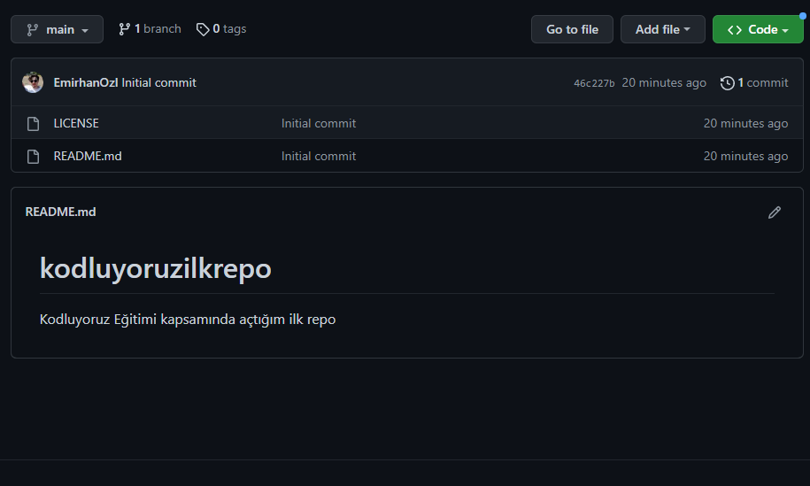

# 1. Kodluyoruz Ilk Repo
Bu repo [Kodluyoruz](kodluyoruz.org) Git Eğitiminde oluşturduğumuz ilk repo, İçerisinde bir adet README dosyası, bir adet de index.html barındırıyor



# Installation
````
https://github.com/EmirhanOzl/kodluyoruzilkrepo.git
````
# Usage
```
cd GitClone
code .
```
# License
[MIT]()
